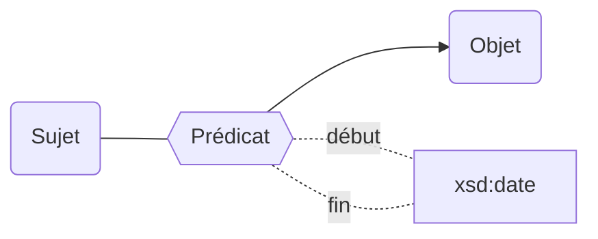

Les propriétés de la modélisation Movies peuvent être bornées dans le temps grâce aux propriétés [`début`](/Ontologie/Propriétés/début) et [`fin`](/Ontologie/Propriétés/fin).

## Modélisation

## Propriétés

| **Propriétés**                            | ***Domain*** | ***Range*** |
| ----------------------------------------- | ------------ | ----------- |
| [début](/Ontologie/Propriétés/début) |              | xsd:date    |
| [fin](/Ontologie/Propriétés/fin)     |              | xsd:date    |

:::caution

### Listes des ropriétés ne pouvant pas être bornées chronologiquement

**Les propriétés internes à l'ontologie :**

* [instance de](/Ontologie/Propriétés/instance%20de)
<!-- * [sous classe de](/Ontologie/Propriétés/sous%20classe%20de) -->
<!-- * [sous propriété de](/Ontologie/Propriétés/sous%20propriété%20de) -->

**Les propriétés relatives aux dates :**

* [début](/Ontologie/Propriétés/début)
* [fin](/Ontologie/Propriétés/fin)
* [fin application](/Ontologie/Propriétés/fin%20application)
* [début application](/Ontologie/Propriétés/début%20application)
* [suppression](/Ontologie/Propriétés/suppression)

**Les identifiants :**

* [code uai](/Ontologie/Propriétés/code%20uai)
* [création](/Ontologie/Propriétés/création)
* [identifiant siren](/Ontologie/Propriétés/identifiant%20siren)
* [identifiant siret](/Ontologie/Propriétés/identifiant%20siret)
* [identifiant idref](/Ontologie/Propriétés/identifiant%20idref)
* [identifiant rsnr](/Ontologie/Propriétés/identifiant%20rnsr)
* [identifiant wikidata](/Ontologie/Propriétés/identifiant%20wikidata)
* [identifiant hal](/Ontologie/Propriétés/identifiant%20hal)
* [identifiant legifrance](/Ontologie/Propriétés/identifiant%20legifrance)
* [identifiant paysage](/Ontologie/Propriétés/identifiant%20paysage)
* [identifiant scanr](/Ontologie/Propriétés/identifiant%20scanr)
* [identifiant contrat](/Ontologie/Propriétés/identifiant%20contrat)
* [uri](/Ontologie/Propriétés/uri)

**autre :**

* forme juridique (le changement de forme juridique entraîne la création d'une nouvelle entité)
:::

## Exemple : Les bornes chronologique de l'habilitation de la COMUE Paris-Saclay à délivrer le doctorat

<Claim property="habilitation doctorale">
    <Statement value="Habilitation doctorale">
        

            <Qualifier property="début">1 septembre 2015</Qualifier>
            <Qualifier property="fin">31 décembre 2019</Qualifier>
        

        <References>
            <Reference>
                <ReferenceElement property="source">STHE</ReferenceElement>
            </Reference>
        </References>
    </Statement>
</Claim>
