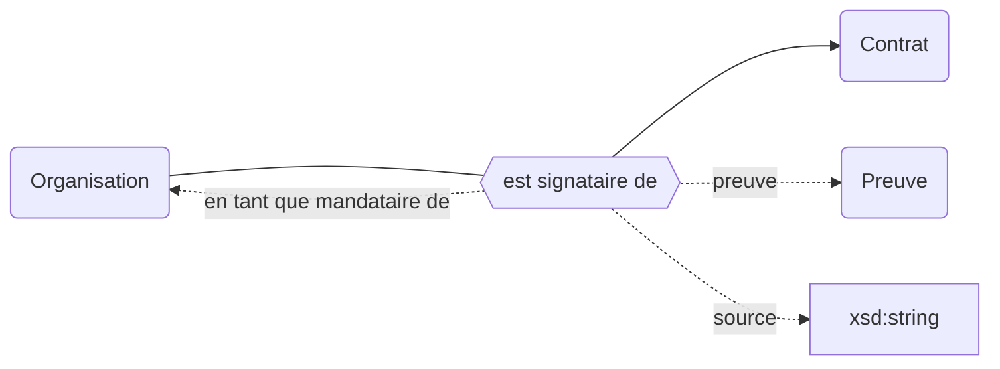
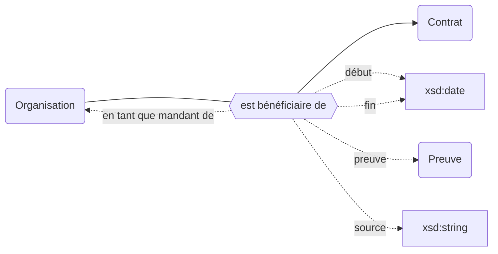
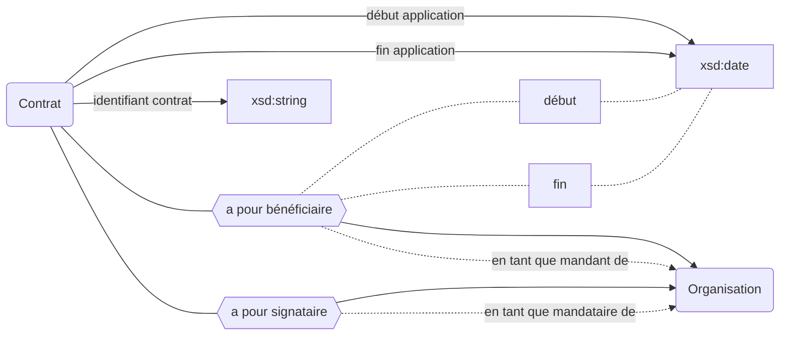

## Modélisation

### Signataires

### Bénéficiaires

### Déscription du contrat

## Propriétés

| **Propriétés**                                                                                  | ***Domain***                                                                                        | ***Range***                                                | **Cardinalité** | **Qualificatifs**                                                                                                                                                                                                                                                                                       |
| ----------------------------------------------------------------------------------------------- | --------------------------------------------------------------------------------------------------- | ---------------------------------------------------------- | --------------- | ------------------------------------------------------------------------------------------------------------------------------------------------------------------------------------------------------------------------------------------------------------------------------------------------------- |
| [est signataire de](/movies-doc/Ontologie/Propriétés/est%20signataire%20de)                     | [Organisation](/movies-doc/Ontologie/Classes/Organisation)                                          | [Contrat](/movies-doc/Ontologie/Classes/Contrat)           | F/R             | [`en tant que mandataire de`](/movies-doc/Ontologie/Propriétés/en%20tant%20que%20mandataire%20de), [`preuve`](/movies-doc/Ontologie/Propriétés/preuve), [`source`](/movies-doc/Ontologie/Propriétés/source)                                                                                             |
| [est bénéficiaire de](/movies-doc/Ontologie/Popriétés/est%20bénéficiaire%20de)                  | [Organisation](/movies-doc/Ontologie/Classes/Organisation)                                          | [Contrat](/movies-doc/Ontologie/Classes/Contrat)           | F/R             | [`en tant que mandant de`](/movies-doc/Ontologie/Propriétés/en%20tant%20que%20mandant%20de), [`preuve`](/movies-doc/Ontologie/Propriétés/preuve), [`source`](/movies-doc/Ontologie/Propriétés/source), [`début`](/movies-doc/Ontologie/Propriétés/début), [`fin`](/movies-doc/Ontologie/Propriétés/fin) |
| [en tant que mandataire de](/movies-doc/Ontologie/Propriétés/en%20tant%20que%20mandataire%20de) | [est signataire de](/movies-doc/Ontologie/Propriétés/est%20signataire%20de)                         | [Organisation](/movies-doc/Ontologie/Classes/Organisation) | F/R             |                                                                                                                                                                                                                                                                                                         |
| [en tant que mandant de](/movies-doc/Ontologie/Propriétés/en%20tant%20que%20mandant%20de)       | [est bénéficiaire de](/movies-doc/Ontologie/Propri%C3%A9t%C3%A9s/est%20b%C3%A9n%C3%A9ficiaire%20de) | [Organisation](/movies-doc/Ontologie/Classes/Organisation) | F/R             |                                                                                                                                                                                                                                                                                                         |
| [identifiant contrat](/movies-doc/Ontologie/Propriétés/identifiant%20contrat)                   | [Contrat](/movies-doc/Ontologie/Classes/Contrat)                                                    | xsd:date                                                   | F/NR            |                                                                                                                                                                                                                                                                                                         |
| [début application](/movies-doc/Ontologie/Propriétés/début%20application)                       | [Preuve](/movies-doc/Ontologie/Classes/Preuve)                                                      | xsd:date                                                   | F/NR            |                                                                                                                                                                                                                                                                                                         |
| [fin application](/movies-doc/Ontologie/Propriétés/fin%20application)                           | [Preuve](/movies-doc/Ontologie/Classes/Preuve)                                                      | xsd:date                                                   | F/NR            |                                                                                                                                                                                                                                                                                                         |

## Définition

Date de début d'application d'un texte réglementaire ou d'un contrat

## Exemple : Les contrats de documentation électronique de Paris 11

Université Paris-Saclay (EPE)

<Claim property="est signataire de">
    <Statement value="Contrat Wiley 2022-03">
        <References>
            <Reference>
                <ReferenceElement property="source">ADELE</ReferenceElement>
            </Reference>
        </References>
    </Statement>
</Claim>

---

Contrat Wiley 2022-03

<Claim property="instance de">
    <Statement value="Contrat">
        <References>
            <Reference>
                <ReferenceElement property="source">ADELE</ReferenceElement>
            </Reference>
        </References>
    </Statement>
</Claim>

<Claim property="début">
    <Statement value="2022">
        <References>
            <Reference>
                <ReferenceElement property="source">ADELE</ReferenceElement>
            </Reference>
        </References>
    </Statement>
</Claim>

<Claim property="a pour signataire">
    <Statement value="Université Paris-Saclay (EPE) ">
        <Qualifier property="en tant que mandataire de">Institut Gustave Roussy</Qualifier>
        <Qualifier property="en tant que mandataire de">CentraleSupélec</Qualifier>
        <Qualifier property="en tant que mandataire de">Université d'Évry-Val d'Essonne</Qualifier>
        <Qualifier property="en tant que mandataire de">École normale supérieure Paris-Saclay</Qualifier>
        <Qualifier property="en tant que mandataire de">Institut d'Optique Graduate School</Qualifier>
        <Qualifier property="en tant que mandataire de">Université de Versailles-Saint-Quentin-en-Yvelines</Qualifier>
        <References>
            <Reference>
                <ReferenceElement property="source">ADELE</ReferenceElement>
            </Reference>
        </References>
    </Statement>
</Claim>

<Claim property="a pour bénéficiaire">
    <Statement value="Université Paris-Saclay (EPE)">
      <Qualifier property="début">2022</Qualifier>
        <References>
            <Reference>
                <ReferenceElement property="source">ADELE</ReferenceElement>
            </Reference>
        </References>
    </Statement>
    <Statement value="Institut Gustave Roussy">
      <Qualifier property="début">2022</Qualifier>
        <References>
            <Reference>
                <ReferenceElement property="source">ADELE</ReferenceElement>
            </Reference>
        </References>
    </Statement>
    <Statement value="...">
    </Statement>
</Claim>
