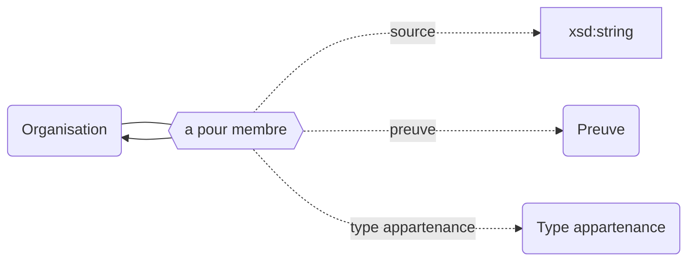

## Modélisation

## Propriétés

Les propriétés suivantes peuvent être utilisées pour rendre compte de la compisition d'un établissement :

| Propriétés                                                          | *Domain*                                                   | *Range*                                                    | **Cardinalité** | **Qualificatifs**                                                                                                                                                                                          |
| ------------------------------------------------------------------- | ---------------------------------------------------------- | ---------------------------------------------------------- | --------------- | ---------------------------------------------------------------------------------------------------------------------------------------------------------------------------------------------------------- |
| [est membre de](/Ontologie/Propriétés/est%20membre%20de) | [Organisation](/Ontologie/Classes/Organisation) | [Organisation](/Ontologie/Classes/Organisation) | F/R             | [`début`](/Ontologie/Propriétés/début), [`fin`](/Ontologie/Propriétés/fin), [`preuve`](/Ontologie/Propriétés/preuve), [`source`](/Ontologie/Propriétés/source) |

Chacune des propriétés listées ci-dessus peut être bornée dans le temps avec les propriétés [`début`](/Ontologie/Propriétés/début) et [`fin`](/Ontologie/Propriétés/fin). Chacune des assertions peut être complétée par une preuve et une source. **L'attribut [`type`](/Ontologie/Propriétés/type) permet de spécifier le type d'[Appartenance](/Ontologie/Classes/Appartenance) : [Membre Associé](/Ontologie/Classes/Appartenance/Membre associé), [Membre constitutif](/Ontologie/Classes/Appartenance/Membre constitutif).**

## Exemple : Les membres de l'EPE Paris-Saclay

Université Paris-Saclay (EPE)

<Claim emphase="true" property="a pour membre">
    <Statement value="Institut national des sciences et industries du vivant et de l'environnement">
        <Qualifier property="début">7 novembre 2019</Qualifier>
        <Qualifier emphase="true" property="type">Membre constitutif</Qualifier>
        <References>
            <Reference>
                <ReferenceElement property="source">Paysage</ReferenceElement>
            </Reference>
        </References>
    </Statement>
     <Statement value="CentraleSupélec">
        <Qualifier property="début">7 novembre 2019</Qualifier>
        <Qualifier emphase="true" property="type">Membre constitutif</Qualifier>
        <References>
            <Reference>
                <ReferenceElement property="source">Paysage</ReferenceElement>
            </Reference>
        </References>
    </Statement>
     <Statement value="École normale supérieure Paris-Saclay">
        <Qualifier property="début">7 novembre 2019</Qualifier>
        <Qualifier emphase="true" property="type">Membre constitutif</Qualifier>
        <References>
            <Reference>
                <ReferenceElement property="source">Paysage</ReferenceElement>
            </Reference>
        </References>
    </Statement>
    <Statement value="Institut d'optique théorique et appliquée">
        <Qualifier property="début">7 novembre 2019</Qualifier>
        <Qualifier emphase="true" property="type">Membre associé</Qualifier>
        <References>
            <Reference>
                <ReferenceElement property="source">Paysage</ReferenceElement>
            </Reference>
        </References>
    </Statement>
    <Statement value="Institut national des sciences et industries du vivant et de l'environnement">
        <Qualifier property="début">7 novembre 2019</Qualifier>
        <Qualifier emphase="true" property="type">Membre associé</Qualifier>
        <References>
            <Reference>
                <ReferenceElement property="source">Paysage</ReferenceElement>
            </Reference>
        </References>
    </Statement>
    <Statement value="Université de Versailles-Saint-Quentin-en-Yvelines">
        <Qualifier property="début">7 novembre 2019</Qualifier>
        <Qualifier emphase="true" property="type">Membre associé</Qualifier>
        <References>
            <Reference>
                <ReferenceElement property="source">Paysage</ReferenceElement>
            </Reference>
        </References>
    </Statement>
        <Statement value="Université d'Évry-Val d'Essonne">
        <Qualifier property="début">7 novembre 2019</Qualifier>
        <Qualifier emphase="true" property="type">Membre associé</Qualifier>
        <References>
            <Reference>
                <ReferenceElement property="source">Paysage</ReferenceElement>
            </Reference>
        </References>
    </Statement>
</Claim>

## Exemple : L'appartenance de l'Université de Versailles-Saint-Quentin-en-Yvelines à l'EPE Paris Saclay

Université de Versailles-Saint-Quentin-en-Yvelines

<Claim emphase="true" property="est membre de">
    <Statement value="Université Paris-Saclay (EPE)">
        <Qualifier property="début">7 novembre 2019</Qualifier>
        <Qualifier emphase="true" property="type">Membre associé</Qualifier>
        <References>
            <Reference>
                <ReferenceElement property="source">Paysage</ReferenceElement>
            </Reference>
        </References>
    </Statement>
</Claim>
