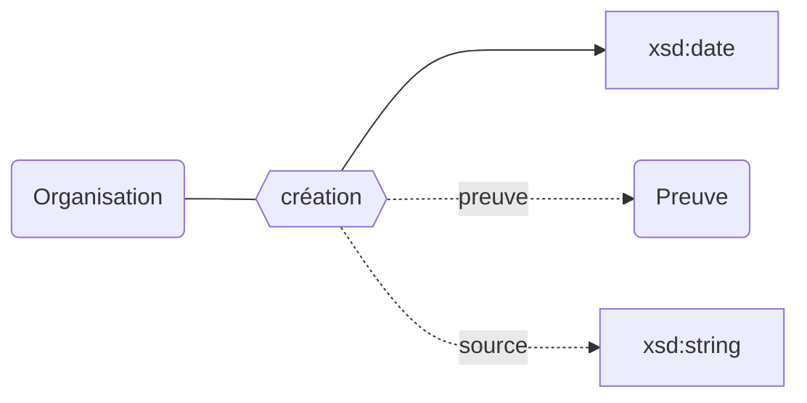
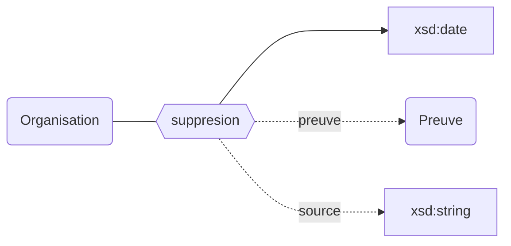

## Modélisation

### Création

### Suppression

## Propriétés

L'existence des établissements peut être décrit avec les propriétés suivantes :

| **Propriétés**                                              | ***Domain***                                               | ***Range*** | ***Cardinalité*** | **Qualificatifs**                                                                                        |
| ----------------------------------------------------------- | ---------------------------------------------------------- | ----------- | ----------------- | -------------------------------------------------------------------------------------------------------- |
| [création](/movies-doc/Ontologie/Propriétés/création)       | [Organisation](/movies-doc/Ontologie/Classes/Organisation) | xsd:date    | O/NR              | [`preuve`](/movies-doc/Ontologie/Propriétés/preuve), [`source`](/movies-doc/Ontologie/Propriétés/source) |
| [suppression](/movies-doc/Ontologie/Propriétés/suppression) | [Organisation](/movies-doc/Ontologie/Classes/Organisation) | xsd:date    | F/NR              | [`preuve`](/movies-doc/Ontologie/Propriétés/preuve), [`source`](/movies-doc/Ontologie/Propriétés/source) |

## Exemple : L'existence de la Comue Paris-Saclay

Université Paris-Saclay (COMUE)

<Claim emphase="true" property="création">
    <Statement value="7 novembre 2019">
    <Qualifier property="preuve">Arrêté du XXXX</Qualifier>
        <References>
            <Reference>
                <ReferenceElement property="source">Paysage</ReferenceElement>
            </Reference>
        </References>
    </Statement>
</Claim>

<Claim emphase="true" property="suppression">
    <Statement value="7 novembre 2019">
        <Qualifier property="preuve">Arrêté du XXXX</Qualifier>
        <References>
            <Reference>
                <ReferenceElement property="source">Paysage</ReferenceElement>
            </Reference>
        </References>
    </Statement>
</Claim>
