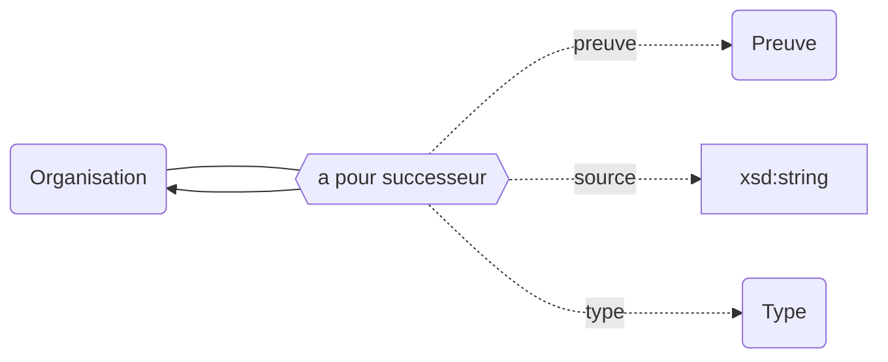

## Modélisation

## Prédécesseurs

## Successeurs

## Propriétés

| **Propriétés**                                                                  | ***Domain***                                                | ***Range***                                                             | ***Cardinalité*** | **Qualificatifs**                                                                                                                                         |
| ------------------------------------------------------------------------------- | ----------------------------------------------------------- | ----------------------------------------------------------------------- | ----------------- | --------------------------------------------------------------------------------------------------------------------------------------------------------- |
| [a pour prédécesseur](/Ontologie/Propriétés/a%20pour%20prédécesseur) | [Organisation](/Ontologie/Classes/Organisation/) | [Organisation](/Ontologie/Classes/Organisation/Organisation) | F/R               | [`type`](/Ontologie/Propriétés/type), [`preuve`](/Ontologie/Propriétés/preuve), [`source`](/Ontologie/Propriétés/source) |
| [a pour successeur](/Ontologie/Propriétés/a%20pour%20successeur)     | [Organisation](/Ontologie/Classes/Organisation/) | [Organisation](/Ontologie/Classes/Organisation/Organisation) | F/R               | [`type`](/Ontologie/Propriétés/type), [`preuve`](/Ontologie/Propriétés/preuve), [`source`](/Ontologie/Propriétés/source) |
| [type](/Ontologie/Propriétés/type)                                   |                                                             | Type                                                                    | F/NR              | [`preuve`](/Ontologie/Propriétés/preuve), [`source`](/Ontologie/Propriétés/source)                                                  |

## Exemple : Généalogie de l'Université Paris-Saclay (COMUE)

<Claim emphase="true" property="a pour prédécesseur">
    <Statement value="Université Paris 11">
        <Qualifier property="preuve">Arrêté du XXX</Qualifier>
        <References>
            <Reference>
                <ReferenceElement property="source">Paysage</ReferenceElement>
            </Reference>
        </References>
    </Statement>
</Claim>

<Claim emphase="true" property="a pour a pour successeur">
    <Statement value="Université Paris-Saclay (EPE)">
        <Qualifier property="preuve">Arrêté du XXX</Qualifier>
        <References>
            <Reference>
                <ReferenceElement property="source">Paysage</ReferenceElement>
            </Reference>
        </References>
    </Statement>
</Claim>
