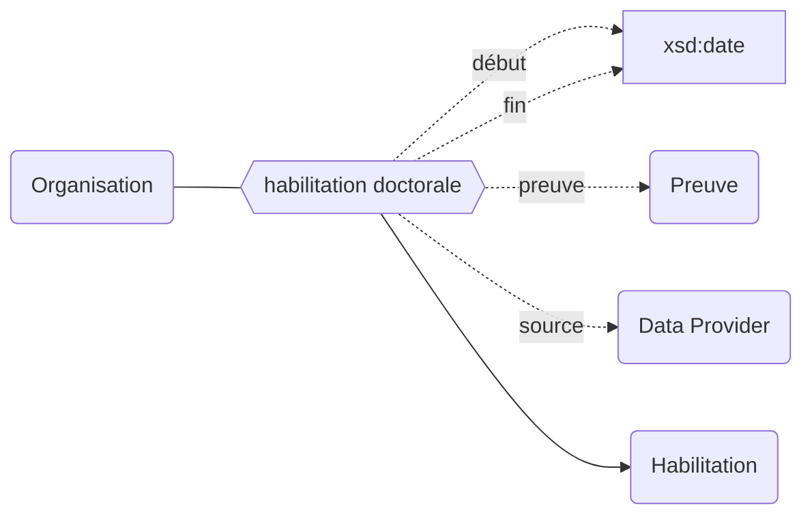

## Modélisation

## Propriétés

| **Propriétés**                                                                      | ***Domain***                                              | ***Range***                                                | **Qualificatifs**                                                                                                                                                                                          |
| ----------------------------------------------------------------------------------- | --------------------------------------------------------- | ---------------------------------------------------------- | ---------------------------------------------------------------------------------------------------------------------------------------------------------------------------------------------------------- |
| [habilitation doctorale](/movies-doc/Ontologie/Propriétés/habilitation%20doctorale) | [Organisation](/movies-doc/Ontologie/Classe/Organisation) | [Habilitation](/movies-doc/Ontologie/Classes/Habilitation) | [`début`](/movies-doc/Ontologie/Propriétés/début), [`fin`](/movies-doc/Ontologie/Propriétés/fin), [`preuve`](/movies-doc/Ontologie/Propriétés/preuve), [`source`](/movies-doc/Ontologie/Propriétés/source) |

## Exemple : L'habilitation doctorale de Paris-Saclay (COMUE)

Université Paris-Saclay (COMUE)

<Claim property="habilitation doctorale">
    <Statement value="Habilitation doctorale">
        <Qualifier property="début">1 septembre 2015</Qualifier>
        <Qualifier property="fin">31 décembre 2019</Qualifier>
        <Qualifier property="preuve">Arrêté du XXX</Qualifier>
        <References>
            <Reference>
                <ReferenceElement property="source">STHE</ReferenceElement>
            </Reference>
        </References>
    </Statement>
</Claim>
