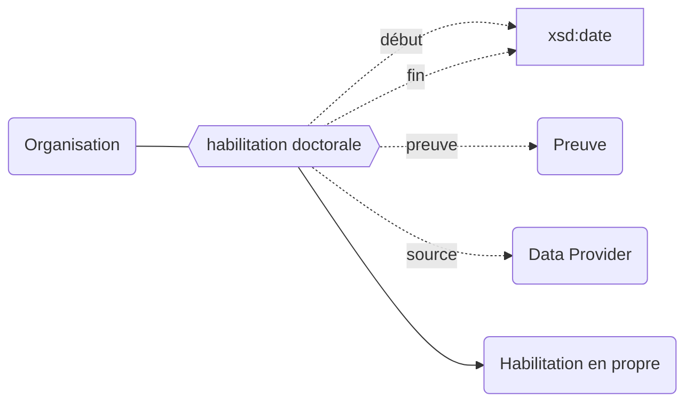
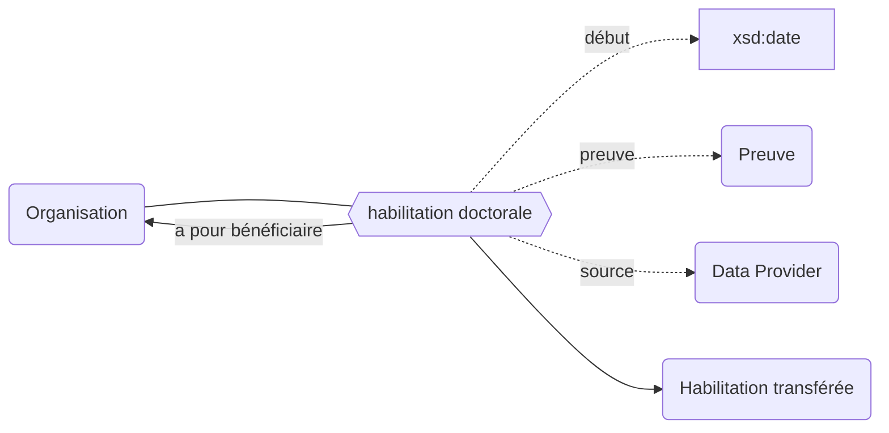
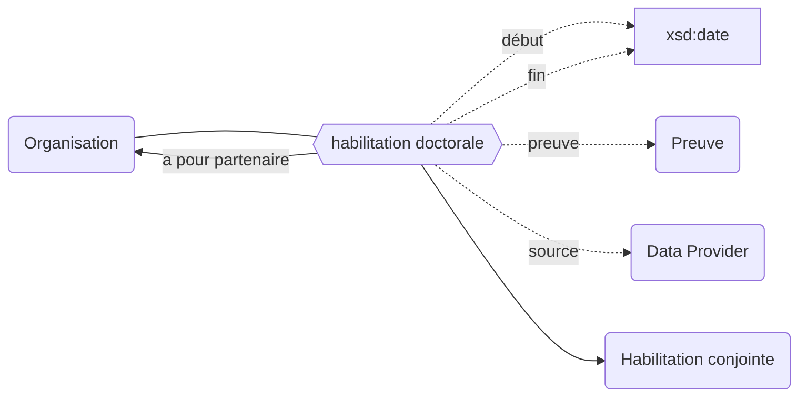
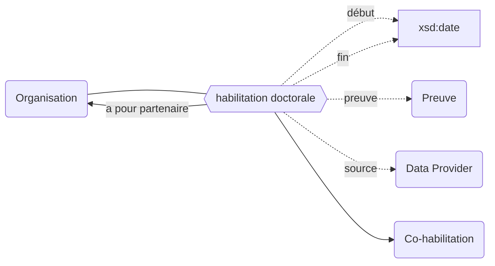

## Modélisation

### Habilitation en propre
Lorsqu'un établissement est habilité à délivrer le doctorat en son nom propre.

### Transfert d'habilitation
Lorsqu'un établissement disparait complètement : l'habilitation doctorale qu'il possédait est transférée définitivement à l'établissement qui est son héritier. Attention il n'y a pas de date de fin lors d'un transfert.

### Délégation d'habilitation
Lorsqu'un établissement délègue tout ou partie de sa compétence doctorale à un autre établissement (dans le cadre d'un regroupement : PRES, ComUE, EPE)

### Habilitation conjointe
Lorsqu'un établissement ne peut pas délivrer le doctorat seul, sans avoir pour partenaire un établissement qui, lui, peut délivrer le diplôme de doctorat en son nom propre. On parle alors de délivrance conjointe.

### Co-habilitation
Lorsque deux établissements délivrent le diplôme de doctorat en même temps, pour les mêmes doctorants.

## Propriétés

| **Propriétés**                                                                      | ***Domain***                                              | ***Range***                                                | **Qualificatifs**                                                                                                                                                                                          |
| ----------------------------------------------------------------------------------- | --------------------------------------------------------- | ---------------------------------------------------------- | ---------------------------------------------------------------------------------------------------------------------------------------------------------------------------------------------------------- |
| [habilitation doctorale](/Ontologie/Propriétés/habilitation%20doctorale) | [Organisation](/Ontologie/Classe/Organisation) | [Habilitation en propre](/Ontologie/Classes/Habilitation%20en%20propre) | [`début`](/Ontologie/Propriétés/début), [`fin`](/Ontologie/Propriétés/fin), [`preuve`](/Ontologie/Propriétés/preuve), [`source`](/Ontologie/Propriétés/source) |

## Exemple : L'habilitation doctorale de Paris-Saclay (COMUE)

Université Paris-Saclay (COMUE)

<Claim property="habilitation doctorale">
    <Statement value="Habilitation doctorale">
        <Qualifier property="début">1 septembre 2015</Qualifier>
        <Qualifier property="fin">31 décembre 2019</Qualifier>
        <Qualifier property="preuve">Arrêté du XXX</Qualifier>
        <References>
            <Reference>
                <ReferenceElement property="source">STHE</ReferenceElement>
            </Reference>
        </References>
    </Statement>
</Claim>

## Exemple : L'habilitation doctorale de Paris 11

Université Paris-Sud (Paris 11)

<Claim property="habilitation doctorale">
    <Statement value="Habilitation en propre">
        <Qualifier property="début">21 mars 1970</Qualifier>
        <Qualifier property="fin">31 août 2014</Qualifier>
        <Qualifier property="preuve">Arrêté du XXX</Qualifier>
        <References>
            <Reference>
                <ReferenceElement property="source">STHE</ReferenceElement>
            </Reference>
        </References>
    </Statement>
    <Statement value="Habilitation déléguée">
        <Qualifier property="début">1 septembre 2015</Qualifier>
        <Qualifier property="fin">31 décembre 2019</Qualifier>
        <Qualifier property="a pour délégataire">Université Paris-Saclay (ComUE)</Qualifier>
        <Qualifier property="preuve">Arrêté du XXX</Qualifier>
        <References>
            <Reference>
                <ReferenceElement property="source">STHE</ReferenceElement>
            </Reference>
        </References>
    </Statement>
    <Statement value="Habilitation transférée">
        <Qualifier property="1 janvier 2020"></Qualifier>
        <Qualifier property="a pour bénéficiaire">université Paris-Saclay (EPE)</Qualifier>
        <Qualifier property="preuve">Arrêté du XXX</Qualifier>
        <References>
            <Reference>
                <ReferenceElement property="source">STHE</ReferenceElement>
            </Reference>
        </References>
    </Statement>
</Claim>
